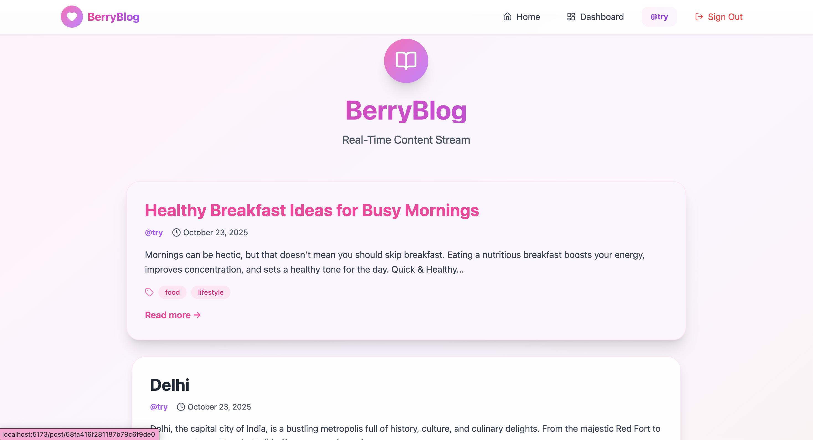
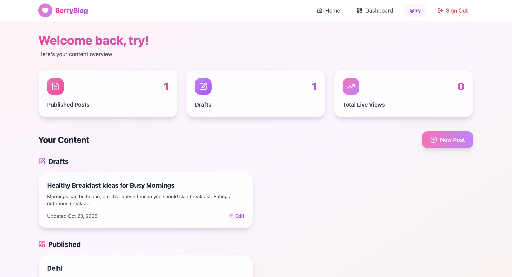
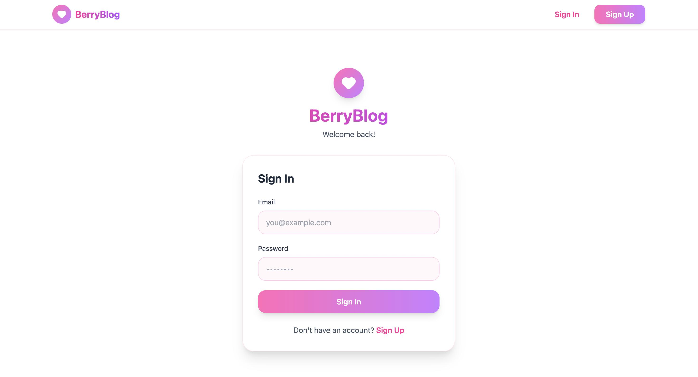
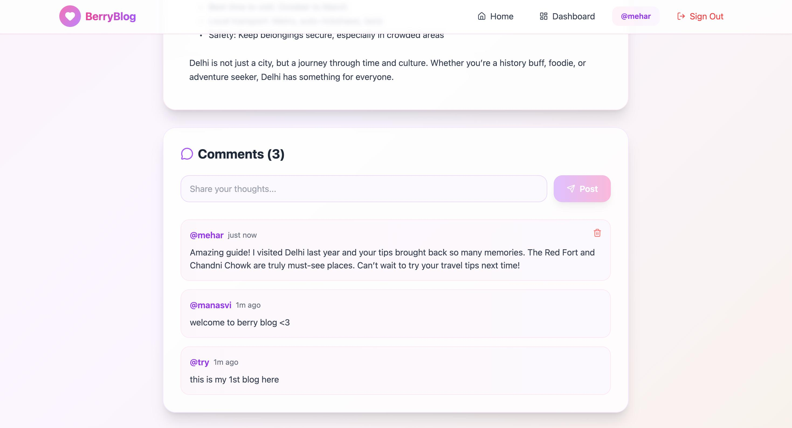

# 🍓 BerryBlog: Real-Time Content Stream

<div align="center">


**A beautiful, real-time blogging platform built with the MERN stack**

[](https://www.mongodb.com/)
[](https://expressjs.com/)
[](https://reactjs.org/)
[](https://nodejs.org/)
[](https://socket.io/)
[](https://tailwindcss.com/)

</div>

---

## 📖 Overview

**BerryBlog** is a modern, full-stack blogging platform that brings real-time engagement to content creation. Built with the MERN stack (MongoDB, Express.js, React, Node.js) and powered by Socket.IO, BerryBlog offers instant updates, live viewer counts, and real-time comments - creating a dynamic and interactive experience for both authors and readers.

### ✨ What Makes BerryBlog Special?

- 🎨 **Beautiful Aesthetic Design** - Soft pink, purple, and cream color palette with glassmorphism effects
- ⚡ **Real-Time Everything** - Live viewer counts, instant comments, and dynamic updates
- 🔐 **Secure Authentication** - JWT-based auth with encrypted passwords
- 📊 **Author Dashboard** - Track your posts, drafts, and total views in real-time
- 💬 **Instant Engagement** - Comments appear instantly for all viewers without page refresh
- 📱 **Fully Responsive** - Beautiful on desktop, tablet, and mobile devices

---
## 🖼️ Screenshots

<div align="center">

<table>
  <tr>
    <td align="center">
      <b>Home Page</b><br>
      
    </td>
    <td align="center">
      <b>Dashboard</b><br>
      
    </td>
  </tr>
  <tr>
    <td align="center">
      <b>Sign Up / Login Page</b><br>
      
    </td>
    <td align="center">
      <b>Comment Section</b><br>
      
    </td>
  </tr>
</table>

</div>
---

## 🎯 Features

### For Readers
- 📚 Browse published posts on a beautiful homepage
- 👁️ See live viewer count on each post
- 💬 Comment in real-time and see others' comments instantly
- 🏷️ Filter posts by tags (coming soon)
- 🔍 Search functionality (coming soon)

### For Authors
- ✍️ Create and edit blog posts with a clean editor
- 📝 Save posts as drafts or publish immediately
- 📊 Dashboard with statistics (published posts, drafts, total views)
- 🗑️ Delete posts and comments
- 👀 Monitor live engagement on your posts
- 🎯 Tag posts for better organization

### Real-Time Features
- 🔴 **Live Viewer Count** - See how many people are reading your post right now
- 💬 **Instant Comments** - Comments appear for all users without refresh
- 🔄 **Auto-Updates** - Content updates propagate to all connected clients
- 📡 **WebSocket Connection** - Efficient real-time communication via Socket.IO

---

## 🛠️ Technology Stack

### Backend
| Technology | Purpose |
|-----------|---------|
| **Node.js** | Runtime environment |
| **Express.js** | Web framework for REST API |
| **MongoDB** | NoSQL database for data persistence |
| **Mongoose** | ODM for MongoDB schema modeling |
| **Socket.IO** | Real-time bidirectional communication |
| **JWT** | Secure authentication tokens |
| **bcryptjs** | Password hashing |

### Frontend
| Technology | Purpose |
|-----------|---------|
| **React 18** | UI library for building interfaces |
| **React Router v6** | Client-side routing |
| **Axios** | HTTP client for API requests |
| **Socket.IO Client** | Real-time updates on frontend |
| **Tailwind CSS** | Utility-first styling framework |
| **Lucide React** | Beautiful icon library |
| **Vite** | Fast build tool and dev server |

---

## 📁 Project Structure

```
berryblog/
├── server/                     # Backend (Express + MongoDB)
│   ├── models/
│   │   └── index.js           # Mongoose schemas (User, Post, Comment, PostView)
│   ├── routes/
│   │   ├── auth.js            # Authentication routes
│   │   └── posts.js           # Post & comment routes with Socket.IO
│   ├── server.js              # Main server file with Socket.IO setup
│   ├── package.json
│   ├── .env                   # Environment variables (DO NOT COMMIT)
│   └── .env.example           # Environment template
│
└── client/                     # Frontend (React + Vite)
    ├── src/
    │   ├── components/
    │   │   ├── Navbar.jsx             # Navigation bar
    │   │   └── CommentSection.jsx     # Real-time comments
    │   ├── contexts/
    │   │   └── AuthContext.jsx        # Authentication state
    │   ├── lib/
    │   │   └── api.js                 # Axios + Socket.IO setup
    │   ├── pages/
    │   │   ├── Home.jsx               # Public homepage
    │   │   ├── Login.jsx              # Login page
    │   │   ├── Register.jsx           # Registration page
    │   │   ├── Dashboard.jsx          # Author dashboard
    │   │   ├── Editor.jsx             # Post editor
    │   │   └── PostView.jsx           # Single post view
    │   ├── App.jsx                    # Main app with routing
    │   ├── main.jsx                   # React entry point
    │   └── index.css                  # Tailwind imports
    ├── public/
    ├── index.html
    ├── package.json
    ├── vite.config.js
    ├── tailwind.config.js
    ├── postcss.config.js
    ├── .env
    └── .env.example
```

---

## 🚀 Installation

### Prerequisites

Before you begin, ensure you have the following installed:
- **Node.js** (v16 or higher) - [Download](https://nodejs.org/)
- **MongoDB** - [Download](https://www.mongodb.com/try/download/community) OR use [MongoDB Atlas](https://www.mongodb.com/cloud/atlas) (recommended)
- **Git** - [Download](https://git-scm.com/)

### Step 1: Clone the Repository

```bash
git clone https://github.com/YOUR_USERNAME/berryblog.git
cd berryblog
```

### Step 2: Backend Setup

```bash
cd server
npm install
```

Create a `.env` file in the `server` directory:

```env
PORT=5000
MONGODB_URI=mongodb://localhost:27017/berryblog
JWT_SECRET=your_super_secret_jwt_key_change_this_in_production
CLIENT_URL=http://localhost:5173
NODE_ENV=development
```

**Important Security Notes:**
- Generate a secure JWT secret using: `node -e "console.log(require('crypto').randomBytes(32).toString('hex'))"`
- For MongoDB Atlas, use format: `mongodb+srv://<username>:<password>@cluster.mongodb.net/berryblog`

Start the backend server:

```bash
npm run dev
```

You should see:
```
✅ MongoDB Connected
🚀 Server running on port 5000
```

### Step 3: Frontend Setup

Open a new terminal window:

```bash
cd client
npm install
```

Create a `.env` file in the `client` directory:

```env
VITE_API_URL=http://localhost:5000
```

Start the development server:

```bash
npm run dev
```

The app will open at `http://localhost:5173`

### Step 4: Access the Application

1. Open your browser to `http://localhost:5173`
2. Click "Sign Up" to create an account
3. Start creating posts and experiencing real-time features!

---

## 💻 Usage

### For Readers

1. **Browse Posts**: Visit the homepage to see all published posts
2. **Read Posts**: Click on any post to read the full content
3. **View Live Count**: See how many people are currently viewing the same post
4. **Comment**: Sign up/login to leave comments that appear instantly

### For Authors

1. **Register/Login**: Create an account to access author features
2. **Access Dashboard**: Navigate to your dashboard to see statistics
3. **Create Post**: Click "New Post" to start writing
4. **Save Draft**: Save your work as a draft to publish later
5. **Publish**: Publish your post to make it visible to all readers
6. **Monitor Engagement**: View live statistics and engagement metrics

---

## 📡 API Documentation

### Base URL
```
http://localhost:5000/api
```

### Authentication Endpoints

#### Register User
```http
POST /auth/register
Content-Type: application/json

{
  "username": "johndoe",
  "email": "john@example.com",
  "password": "securepassword123"
}
```

**Response:**
```json
{
  "message": "User registered successfully",
  "token": "eyJhbGciOiJIUzI1NiIsInR5cCI6IkpXVCJ9...",
  "user": {
    "id": "507f1f77bcf86cd799439011",
    "username": "johndoe",
    "email": "john@example.com",
    "role": "author"
  }
}
```

#### Login User
```http
POST /auth/login
Content-Type: application/json

{
  "email": "john@example.com",
  "password": "securepassword123"
}
```

#### Get Current User
```http
GET /auth/me
Authorization: Bearer <token>
```

### Post Endpoints

#### Get All Published Posts
```http
GET /posts
```

#### Get Single Post
```http
GET /posts/:id
```

#### Get My Posts (Protected)
```http
GET /posts/user/my-posts
Authorization: Bearer <token>
```

#### Get Dashboard Stats (Protected)
```http
GET /posts/user/stats
Authorization: Bearer <token>
```

**Response:**
```json
{
  "publishedCount": 5,
  "draftCount": 2,
  "totalViews": 247
}
```

#### Create Post (Protected)
```http
POST /posts
Authorization: Bearer <token>
Content-Type: application/json

{
  "title": "My First Post",
  "content": "This is the content of my post...",
  "tags": ["javascript", "react"],
  "status": "published"
}
```

#### Update Post (Protected)
```http
PUT /posts/:id
Authorization: Bearer <token>
Content-Type: application/json

{
  "title": "Updated Title",
  "content": "Updated content...",
  "status": "published"
}
```

#### Delete Post (Protected)
```http
DELETE /posts/:id
Authorization: Bearer <token>
```

### Comment Endpoints

#### Get Post Comments
```http
GET /posts/:postId/comments
```

#### Add Comment (Protected)
```http
POST /posts/:postId/comments
Authorization: Bearer <token>
Content-Type: application/json

{
  "content": "Great post!"
}
```

#### Delete Comment (Protected)
```http
DELETE /posts/:postId/comments/:commentId
Authorization: Bearer <token>
```

---

## 🔌 Socket.IO Events

### Client → Server

```javascript
// Join a post's room for real-time updates
socket.emit('JOIN_POST_ROOM', postId);

// Leave a post's room
socket.emit('LEAVE_POST_ROOM', postId);
```

### Server → Client

```javascript
// Receive live viewer count updates
socket.on('LIVE_COUNT_UPDATE', (data) => {
  console.log(data); // { postId, viewerCount }
});

// Receive new comments instantly
socket.on('NEW_COMMENT', (comment) => {
  console.log(comment); // Full comment object
});

// Receive comment deletion notifications
socket.on('DELETE_COMMENT', (commentId) => {
  console.log(commentId); // ID of deleted comment
});
```

---

## 🎨 Design System

### Color Palette

```css
/* Primary Colors */
--pink-400: #f472b6;      /* Primary pink */
--pink-500: #ec4899;      /* Darker pink */
--purple-400: #c084fc;    /* Primary purple */
--purple-500: #a855f7;    /* Darker purple */

/* Backgrounds */
--pink-50: #fdf2f8;       /* Light pink background */
--purple-50: #faf5ff;     /* Light purple background */
--cream-50: #fffbf5;      /* Cream background */
--cream-100: #fff7eb;     /* Darker cream */

/* Accent Colors */
--pink-100: #fce7f3;      /* Light pink accents */
--purple-100: #f3e8ff;    /* Light purple accents */
```

### Typography

- **Headings**: System font stack with gradient text
- **Body**: Sans-serif for readability
- **Code**: Monospace for technical content

### Components

- **Glassmorphism**: `bg-white/80 backdrop-blur-sm`
- **Rounded Corners**: `rounded-3xl` (48px), `rounded-2xl` (16px)
- **Shadows**: `shadow-xl` with hover effects
- **Gradients**: Pink to purple combinations

---

## 🧪 Testing

### Manual Testing Checklist

- [ ] User registration works
- [ ] User login works
- [ ] Dashboard displays correct statistics
- [ ] Can create draft post
- [ ] Can publish post
- [ ] Post appears on homepage
- [ ] Live viewer count updates
- [ ] Comments appear instantly
- [ ] Can delete own comments
- [ ] Can edit posts
- [ ] Can delete posts

### Testing with curl

```bash
# Test health endpoint
curl http://localhost:5000/api/health

# Register user
curl -X POST http://localhost:5000/api/auth/register \
  -H "Content-Type: application/json" \
  -d '{"username":"testuser","email":"test@test.com","password":"test123"}'

# Get all posts
curl http://localhost:5000/api/posts
```

---

## 🚢 Deployment

### Backend Deployment (Render/Railway/Heroku)

1. Create account on your chosen platform
2. Connect your GitHub repository
3. Set environment variables:
   - `MONGODB_URI`
   - `JWT_SECRET`
   - `CLIENT_URL`
   - `NODE_ENV=production`
4. Deploy!

### Frontend Deployment (Vercel/Netlify)

1. Build the application:
   ```bash
   cd client
   npm run build
   ```
2. Deploy the `dist` folder
3. Set environment variable:
   - `VITE_API_URL=https://your-backend-url.com`

### MongoDB (Atlas)

1. Create MongoDB Atlas account
2. Create cluster and database
3. Whitelist IP addresses (0.0.0.0/0 for all)
4. Get connection string
5. Update `MONGODB_URI` in environment variables

---

## 🤝 Contributing

Contributions are welcome! Please follow these steps:

1. **Fork the repository**
2. **Create a feature branch**
   ```bash
   git checkout -b feature/AmazingFeature
   ```
3. **Commit your changes**
   ```bash
   git commit -m 'Add some AmazingFeature'
   ```
4. **Push to the branch**
   ```bash
   git push origin feature/AmazingFeature
   ```
5. **Open a Pull Request**

### Development Guidelines

- Follow existing code style
- Write meaningful commit messages
- Test your changes thoroughly
- Update documentation if needed
- Add comments for complex logic

---

## 🐛 Troubleshooting

### Common Issues

**"Cannot connect to MongoDB"**
- Ensure MongoDB is running locally or check Atlas connection string
- Verify network access in MongoDB Atlas
- Check firewall settings

**"Port already in use"**
```bash
# Kill process on port 5000
lsof -ti:5000 | xargs kill -9
```

**"Module not found"**
```bash
# Reinstall dependencies
rm -rf node_modules package-lock.json
npm install
```

**"Socket.IO not connecting"**
- Verify CORS settings in `server.js`
- Check `CLIENT_URL` environment variable
- Ensure both backend and frontend are running

---

## 📄 License

This project is licensed under the MIT License - see the [LICENSE](LICENSE) file for details.

---

## 👥 Authors

- **Manasvi Sabbarwal** - *Initial work* - [Manasvi-247](https://github.com/Manasvi-247)

---

## 🙏 Acknowledgments

- Built with the MERN stack
- Real-time features powered by Socket.IO
- Design inspired by modern web aesthetics
- Icons by Lucide React
- Styled with Tailwind CSS

---


## 💖 Show Your Support

Give a ⭐️ if this project helped you!

---

<div align="center">

**Built with 💖 using the MERN stack and Socket.IO**

[⬆ Back to Top](#-berryblog-real-time-content-stream)

</div>
